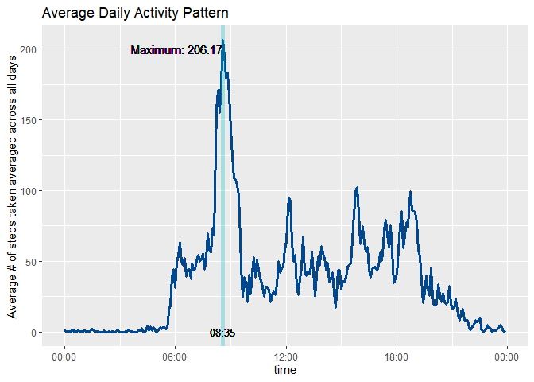

## Loading and preprocessing the data

Via read.csv function to load the our data set.  
Then by summary function we can have a taste on our data!

```r
library(lubridate)
library(dplyr)
library(ggplot2)
data <- read.csv("./activity.csv",header = T)
summary(data)
```

```
##      steps            date              interval     
##  Min.   :  0.00   Length:17568       Min.   :   0.0  
##  1st Qu.:  0.00   Class :character   1st Qu.: 588.8  
##  Median :  0.00   Mode  :character   Median :1177.5  
##  Mean   : 37.38                      Mean   :1177.5  
##  3rd Qu.: 12.00                      3rd Qu.:1766.2  
##  Max.   :806.00                      Max.   :2355.0  
##  NA's   :2304
```
From above summary, we can notice there are 2304 intervals (observation) missing values of steps. We will focus on treating missing value in later part. The variable "date" is also stored in character, thus I loaded relavent library to transform the variable into R date class.


```r
data <- data %>%
    transform(date = ymd(date))
```


## What is mean total number of steps taken per day?
To plot histogram of total steps taken per day as well as calculate means and median steps taken per day, I preprocess the data in following way:

1. Group the data by date.  
2. Calculate the summation of each data
3. Plot histogram with ggplot2.
4. Draw verticle line to display mean and median

## What is the average daily activity pattern?

```r
df_q1 <- data %>%
    group_by(date) %>%
    summarise(sum_of_step = sum(steps,na.rm = T))

ggplot(data = df_q1, aes(x = sum_of_step )) +
    geom_histogram(bins = 25)+
    
    geom_vline(xintercept = mean(df_q1$sum_of_step),color = "#F8766D", size = 2)+
    geom_vline(xintercept = median(df_q1$sum_of_step),color = "#00BFC4",size = 2)+
    
    geom_text(aes(label = paste("mean: ",format(round(mean(df_q1$sum_of_step),2),big.mark = ",")),x    =mean(df_q1$sum_of_step),y=10),hjust = 1.1, vjust = -0.5,color = "#F8766D") +
    geom_text(aes(label = paste("median:",format(round(median(df_q1$sum_of_step),2),big.mark = ",")),x =mean(df_q1$sum_of_step),y=10),hjust = -0.4, vjust = 0.5,color = "#00BFC4")
```

<!-- -->

## what is the average daily activity pattern?
To plot time series of daily activity pattern, we first calculate average numbers
of steps taken aveaged across all days via following steps:

1. Group data by interval  
2. Calculate average of each interval  


```r
int_time_converter <- function(x){
    time_str <- as.character(x)
    time_str <- paste0(paste0(rep("0",4 - nchar(time_str)),collapse = ''),time_str)
    return(time_str)
}

df_q2 <- data %>%
    group_by(interval) %>%
    summarise(avg_step = mean(steps, na.rm = T))

df_q2$time <- as.POSIXct(unlist(lapply(df_q2$interval,int_time_convert)),format = "%H%M")
    
ggplot(data = df_q2, aes(x = time, y = avg_step))+
    geom_line(color = "#00478f",size = 1.2)+
    scale_x_datetime(date_labels = "%H:%M")+
    labs(title = "Average Daily Activity Pattern")+
    ylab("Average # of steps taken averaged across all days")
```

<!-- -->

## Imputing missing values


## Are there differences in activity patterns between weekdays and weekends?
