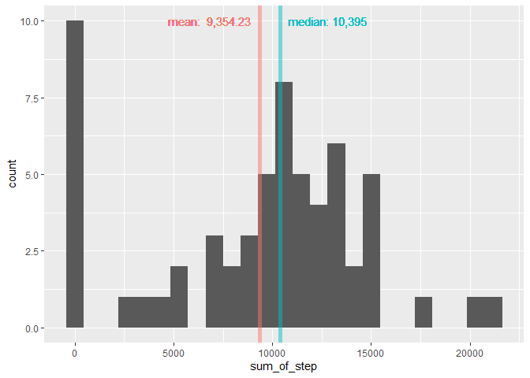
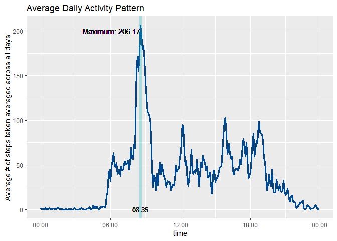
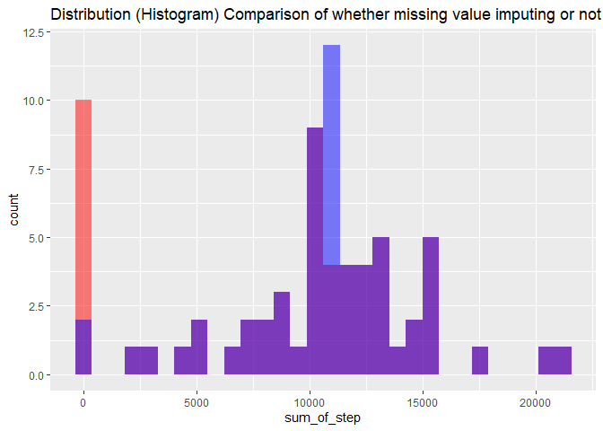
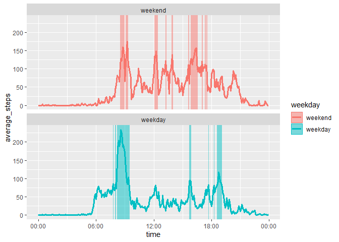

## Loading and preprocessing the data

I loaded the data Via read.csv function, and then by summary function we can have a taste on our data!

```r
library(lubridate)
library(dplyr)
library(ggplot2)
data <- read.csv("./activity.csv",header = T)
summary(data)
```

```
##      steps            date              interval     
##  Min.   :  0.00   Length:17568       Min.   :   0.0  
##  1st Qu.:  0.00   Class :character   1st Qu.: 588.8  
##  Median :  0.00   Mode  :character   Median :1177.5  
##  Mean   : 37.38                      Mean   :1177.5  
##  3rd Qu.: 12.00                      3rd Qu.:1766.2  
##  Max.   :806.00                      Max.   :2355.0  
##  NA's   :2304
```
From above summary, we can notice there are 2304 intervals (observation) missing values of steps. Missing value will be imputed later, and I focused mainly on variable "date" and "interval", since both of these interval are stored as data class hard to manipulate and plot.

1. Transform "date" from character to date object.  
2. Transform "interval" from integer to character with my self-defined int_time_converter function, then use as.POSIXct function to transform character to POSIXct class.


```r
data <- data %>%
    transform(date = ymd(date))

int_time_converter <- function(x){
    time_str <- as.character(x)
    time_str <- paste0(paste0(rep("0",4 - nchar(time_str)),collapse = ''),time_str)
    return(time_str)
}

data$time <- as.POSIXct(unlist(lapply(data$interval,int_time_converter)),format = "%H%M")
```

## What is mean total number of steps taken per day?
To plot histogram of total steps taken per day as well as calculate means and median steps taken per day, I preprocess the data in following way:

1. Group the data by date.  
2. Calculate the summation of each data
3. Plot histogram with ggplot2.
4. Draw vertical line to display mean and median


```r
df_q1 <- data %>%
    group_by(date) %>%
    summarise(sum_of_step = sum(steps,na.rm = T))

ggplot(data = df_q1, aes(x = sum_of_step )) +
    geom_histogram(bins = 25)+
    
    geom_vline(xintercept = mean(df_q1$sum_of_step),color = "#F8766D", size = 2,alpha = 0.5)+
    geom_vline(xintercept = median(df_q1$sum_of_step),color = "#00BFC4",size = 2,alpha = 0.5)+
    
    geom_text(aes(label = paste("mean: ",format(round(mean(df_q1$sum_of_step),2),big.mark = ",")),x    =mean(df_q1$sum_of_step),y=10),hjust = 1.1, vjust = 0.5,color = "#F8766D") +
    geom_text(aes(label = paste("median:",format(round(median(df_q1$sum_of_step),2),big.mark = ",")),x =median(df_q1$sum_of_step),y=10),hjust = -0.1, vjust = 0.5,color = "#00BFC4")
```

<!-- -->

## what is the average daily activity pattern?
To plot time series of daily activity pattern, we first calculate average numbers of steps taken across all days via following steps:

1. Group data by interval  
2. Calculate average of each interval  
3. Compute the maximum value of averaged step.  
4. Find time interval the maximum value lies in.  


```r
Sys.setlocale("LC_TIME","C")
```

```
## [1] "C"
```

```r
df_q2 <- data %>%
    group_by(time) %>%
    summarise(avg_step = mean(steps, na.rm = T))

max <- max(df_q2$avg_step)
max_time <- df_q2$time[df_q2$avg_step == max]

ggplot(data = df_q2, aes(x = time, y = avg_step))+
    geom_line(color = "#00478f",size = 1.2)+
    geom_vline(xintercept = max_time, color = "#00BFC4",size = 2, alpha = 0.3)+
    geom_text(aes(label = paste("Maximum:" ,format(round(max,2),big.mark = ",")), x = max_time, y = 200),hjust = 1 )+
    geom_text(aes(label = format(max_time, "%H:%M"), x = max_time, y = 0),size = 3.5,color = "black")+
    scale_x_datetime(date_labels = "%H:%M")+
    labs(title = "Average Daily Activity Pattern")+
    ylab("Average # of steps taken averaged across all days")
```

<!-- -->
## Imputing missing values

From the summary result in the 1st code chunk, we know that there's 2304 observation missing "steps".
2. I will use average mean of 5 minutes interval, which is 37.3826,  to fill missing value. 


```r
mean_steps <- mean(data$steps,na.rm = T)
print(paste0("Average steps of each time interval: ",round(mean_steps,2)))
```

```
## [1] "Average steps of each time interval: 37.38"
```

```r
new_data <- data
new_data$steps[is.na(new_data$steps)] <- mean_steps
```

3. As the assignment instructed, I re-plot histogram of new data(with missing value imputed with average.)
- However, instead of plotting new histogram alone, I would like to overlap two histogram (new v.s old) to have a better understanding changes in distribution resulted from missing value imputing.  
- Red histogram \textcolor{red}{red} represent old data set, blue \textcolor{blue}{blue} represent new data set. In addition, I set alpha equal 0.5, thus overlapping part would be purple.\textcolor{purple}{purple} 


```r
df_q3 <- new_data %>%
    group_by(date) %>%
    summarise(sum_of_step = sum(steps,na.rm = T))

seq <- rep(1:2, each = 61)

df_q3 <- cbind(rbind(df_q1,df_q3),seq)
df_q3 <- mutate(df_q3,seq = recode_factor(seq,"1" = "No Imputing", "2" = "Imputing"))


ggplot(data = df_q3, aes(x = sum_of_step)) +
    geom_histogram(data = subset(df_q3, seq =="No Imputing"),fill = "red",alpha = 0.5)+
    geom_histogram(data = subset(df_q3, seq =="Imputing"),fill = "blue",alpha = 0.5)+
    labs(title = "Distribution (Histogram) Comparison of whether missing value imputing or not")
```

```
## `stat_bin()` using `bins = 30`. Pick better value with `binwidth`.
## `stat_bin()` using `bins = 30`. Pick better value with `binwidth`.
```

<!-- -->
From above graph, we can noticed that most part of distribution (Purple part.) doesn't change at all but huge decrease of frequency of 0 steps per day, and sudden increase of frequency of 11,000 steps per day.

It clearing indicating that missing value are concentrated in certain date!(If it's evenly or randomly distributed in different dates, we supposed to see entire distribution shifting rightward.)
As a matter of fact, we can use table to confirm my thoughts. and indeed NA value concentrated in 8 days, and these 8 days are full of NA value.

```r
table(data$date[is.na(data$steps)])
```

```
## 
## 2012-10-01 2012-10-08 2012-11-01 2012-11-04 2012-11-09 2012-11-10 
##        288        288        288        288        288        288 
## 2012-11-14 2012-11-30 
##        288        288
```
Let's see how mean and median of total number of steps taken per day changes after imputing missing value with average.

```r
table <- df_q3 %>%
    group_by(seq) %>%
    summarise(Mean = mean(sum_of_step),Median = median(sum_of_step))
table
```

```
## # A tibble: 2 x 3
##   seq           Mean Median
##   <fct>        <dbl>  <dbl>
## 1 No Imputing  9354. 10395 
## 2 Imputing    10766. 10766.
```
We can see that both mean and median increase by 1,400, and mean and median becomes the same value (10766.19).


## Are there differences in activity patterns between weekdays and weekends?
1. To analyze if there's differences in activity pattern between weekdays and weekends, let first create a new variable differentiate weekend from weekdays.


```r
data <- data %>%
  mutate(weekday = weekdays(date)) %>%
  mutate(weekday = as.factor(weekday %in% c('Saturday','Sunday'))) %>%
  mutate(weekday = recode_factor(weekday,"TRUE" = "weekend","FALSE" = "weekday"))
```
2. Secondly, we will plot 2 time series of the 5-minute interval and average number of steps take, averaged across all weekday days or weekend days. (Noted that missing value are ignored in the analysis because of concentrated missing value.)

3. In addition to assignment request, I would like to visualize which time interval are the subject most active. I define active time interval as the interval when average steps taken is equal or above 90th percentile of average steps taken per interval.


```r
df_q4 <- data %>%
  group_by(time,weekday) %>%
  summarise(average_steps = mean(steps,na.rm = T))%>%
  ungroup() %>%
  group_by(weekday) %>%
  mutate(active_interval = (average_steps >= quantile(average_steps,probs = 0.9)))
```

```
## `summarise()` has grouped output by 'time'. You can override using the `.groups` argument.
```

```r
weekday_int_df <- df_q4 %>%
  filter(active_interval == T) %>%
  mutate(upper = time + 60*5)


ggplot(df_q4,aes(time,average_steps,fill = weekday,color = weekday))+
  geom_line(size = 1.2)+
  geom_rect(data = weekday_int_df,
            aes( x = NULL, y = NULL, xmin = time, xmax = upper, ymin = -Inf,ymax = Inf,color = NULL), 
            alpha = 0.5
            )+
  facet_wrap(.~weekday,nrow = 2)+
  scale_x_datetime(date_labels = ("%H:%M"))
```

<!-- -->

At last, we can see from the plot that the most active interval in weekday centered at 7 a.m. and 7 p.m. , which is probably the subject's commute time to school/office. And in weekend, active time intervals are more scattered throughout the day. There're other interesting active time interval worth more investigation. (ex: why the subject are active around 4 p.m both in weekend and weekday.), but that's beyond the scope of assignment and maybe required information more than the data set.


